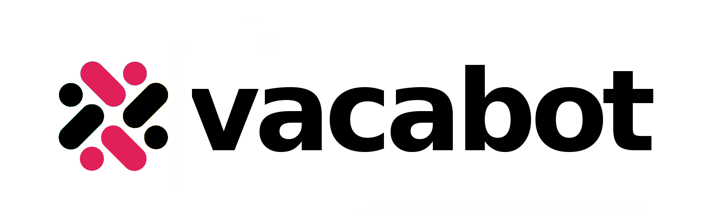
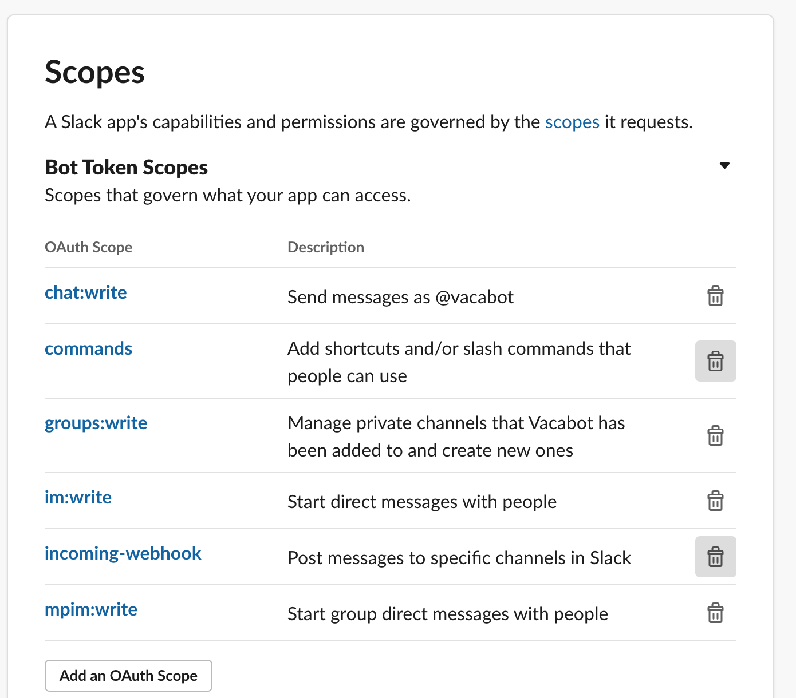

# VacaBot



Vacabot helps organisation to easily manager leaves/vacation plans without depending upon any extra service potal. Everything through a slackbot.

## Running locally
1. You need db connection and bot auth token.\
`cp .env.example .env`\
Populate `.env` with required values.
2. Install dependencies and run through yarn ([Install yarn from here](https://classic.yarnpkg.com/en/docs/install/#mac-stable))\
`yarn && yarn start`
3. In another tab\
`yarn ngrok http 80`

You'll get public links. Copy https one for later use.

## How to setup the Slack Bot?

1. Create a [Slack App](https://api.slack.com/apps?new_app=1).
2. Check your newly created app in [Dashboard](https://api.slack.com/apps/)
3. Go back to Slack. Create a channel, give a name(ex: vacabot)
4. In left side bar, choose *Incoming Webhooks* and *Activate Incoming Webhooks*.\
   Scroll down to *Webhook URLs for Your Workspace* and add a new one.
   
   It will take you new page which asks you to assign a channel where your bot can post messages.
   
5. In side bar, choose *Interactivity & Shortcuts*. Enable it and add your ngrok url in *Under URL*
6. In side bar, choose *Slash Commands*. *Create New Command*.
   
   In *Request URL* add your ngrok url.
7. In side bar, choose *OAuth & Permissions*. Now enable bot access. Copy *Bot User OAuth Access Token* for later use.
   
   Scroll down in *Scopes*. Add these OAuth Scopes in *Bot Token Scopes* if not present:
     ```chat:write, commands, groups:write, im:write, incoming-webhook, mpim:write```
   

## Usage

1. Become a manager:
    `/vacabot manager`
2. Create leave request:
    `/vacabot`
3. Check leave balance of an employee
    `/vacabot @username`

## Slack Community
Here you can try out the vacabot bot already installed and being used.
[Joining link](https://join.slack.com/t/hacktoberfestindia/shared_invite/zt-ifcel7xs-Bnv2Vk73MmtU7xKU~nvSaQ) (valid until 10th November)

