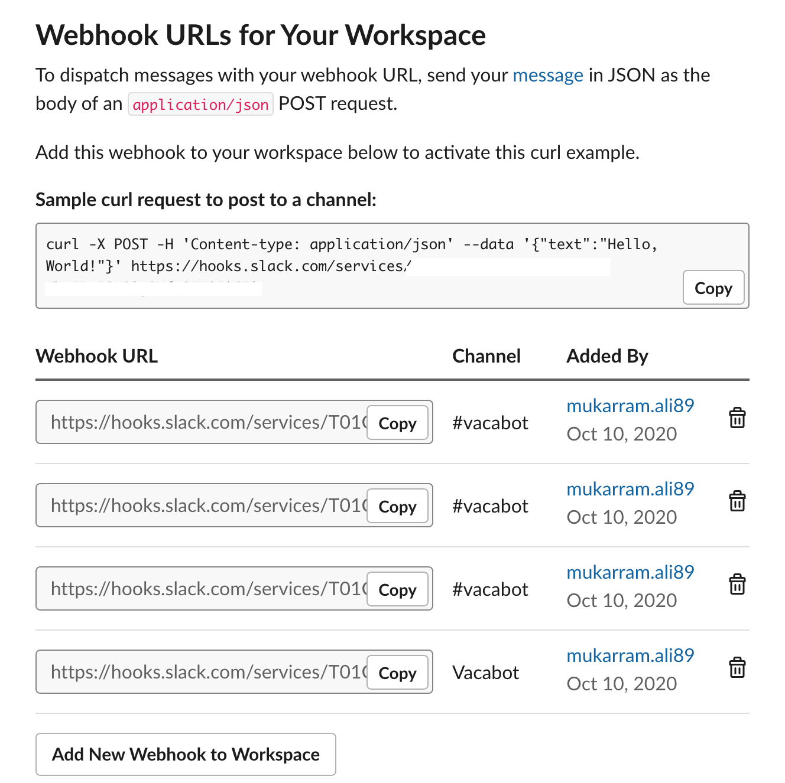
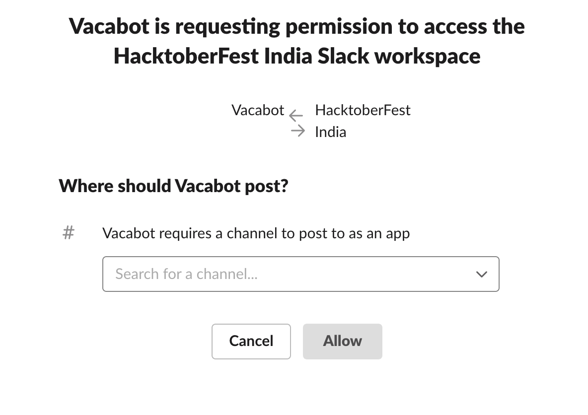
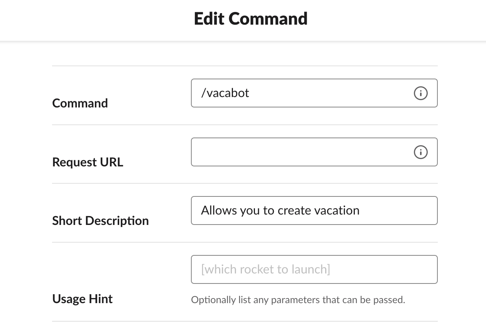
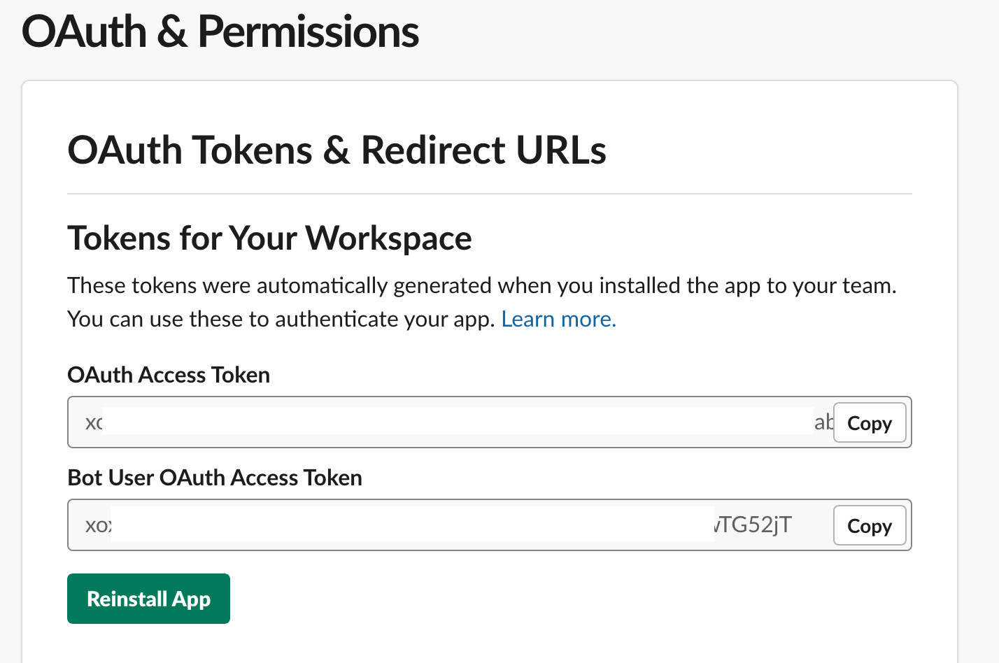

## How to setup the Slack Bot?

1. Create a [Slack App](https://api.slack.com/apps?new_app=1).
2. Check your newly created app in [Dashboard](https://api.slack.com/apps/)
3. Go back to Slack. Create a channel, give a name(ex: vacabot)
4. In left side bar, choose *Incoming Webhooks* and *Activate Incoming Webhooks*.\
   Scroll down to *Webhook URLs for Your Workspace* and add a new one.
   
   It will take you new page which asks you to assign a channel where your bot can post messages.
   
5. In side bar, choose *Interactivity & Shortcuts*. Enable it and add your ngrok url in *Under URL*
6. In side bar, choose *Slash Commands*. *Create New Command*.
   
   In *Request URL* add your ngrok url.
7. In side bar, choose *OAuth & Permissions*. Now enable bot access. Copy *Bot User OAuth Access Token* for later use.
   
   Scroll down in *Scopes*. Add these OAuth Scopes in *Bot Token Scopes* if not present:
     ```chat:write, commands, groups:write, im:write, incoming-webhook, mpim:write```
   

